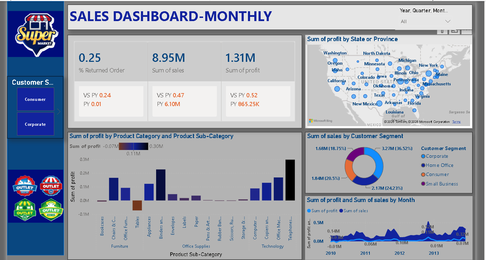

# 📊 Superstore Sales Dashboard – Power BI

## 📌 Project Overview

**Superstore Sales Dashboard** is an interactive Power BI project designed to analyze sales, profit, orders, customers, products, and regional business performance.

The dashboard transforms Superstore sales data into meaningful visual insights using data cleaning, data modeling, DAX calculations, and interactive Power BI visualizations.

---

## 🛠️ Tools & Technologies

* **Power BI**
* **Power Query**
* **DAX**
* **Data Modeling**
* **Data Visualization**
* **Excel**

---

## 🎯 Project Objective

The main objective of this project is to analyze Superstore sales data and provide an interactive dashboard for monitoring business performance.

The dashboard helps users understand:

* Sales performance
* Profitability
* Order trends
* Product performance
* Customer segments
* Regional performance
* Category and sub-category performance

---

## 📈 Key KPIs

| KPI            | Description                       |
| -------------- | --------------------------------- |
| Total Sales    | Overall sales generated           |
| Total Profit   | Overall profit generated          |
| Total Orders   | Number of orders                  |
| Total Quantity | Total quantity of products sold   |
| Average Sales  | Average sales performance         |
| Profit Margin  | Profitability compared with sales |

---

## 🔍 Key Business Analysis

The dashboard can be used to analyze:

* Which products generate the highest sales?
* Which products generate the highest profit?
* Which categories and sub-categories perform well?
* Which regions contribute the most sales?
* How are sales changing over time?
* Which customer segments generate significant revenue?
* Where are sales and profitability relatively lower?
* What are the major trends in the business?

---

## 📊 Power BI Skills Demonstrated

### Data Preparation

* Data cleaning using Power Query
* Data transformation
* Data type management
* Preparing data for analysis

### Data Modeling

* Table relationships
* Date-based analysis
* Product analysis
* Customer analysis
* Regional analysis

### DAX

* KPI calculations
* Sales calculations
* Profit calculations
* Order calculations
* Aggregations
* Percentage and ratio calculations

### Data Visualization

* KPI cards
* Bar charts
* Column charts
* Line charts
* Tables
* Interactive filters and slicers
* Geographic/region analysis

---

## 📸 Dashboard Preview

---

## 💡 Business Value

This dashboard demonstrates how Power BI can be used to convert raw sales data into an interactive business intelligence solution.

It provides a simple way for users and decision-makers to monitor key performance indicators and explore sales and profitability across different business dimensions.

---

## 👨‍💻 Author

**Doli Arya**

Power BI | Data Analytics | DAX | Excel | Business Intelligence
